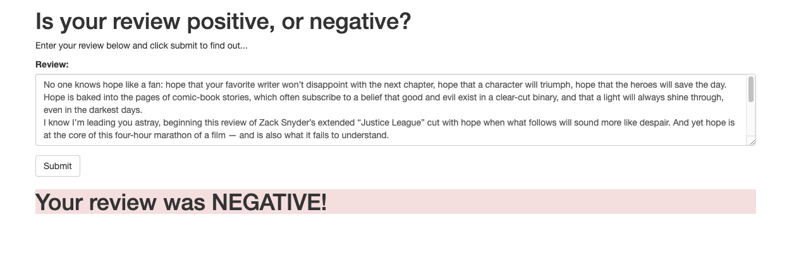

# SageMaker Deployment Project

The notebook and Python files provided result in a simple web app which interacts with a deployed recurrent neural network performing sentiment analysis on movie reviews.

The simple `index.html` page allows a single movie review to be entered and once submitted it return a response with a sentiment assessment of the review being positive or negative.

Please see the [README](https://github.com/udacity/sagemaker-deployment/tree/master/README.md) in the root directory for instructions on setting up a SageMaker notebook and downloading the project files (as well as the other notebooks).
